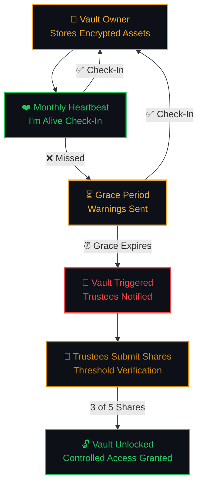
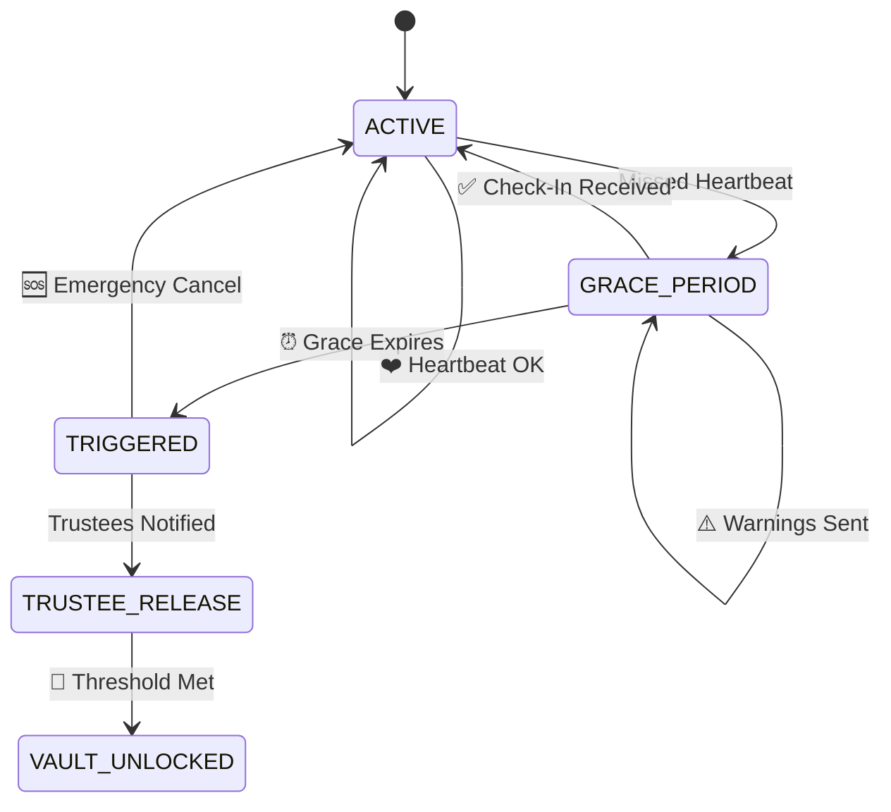
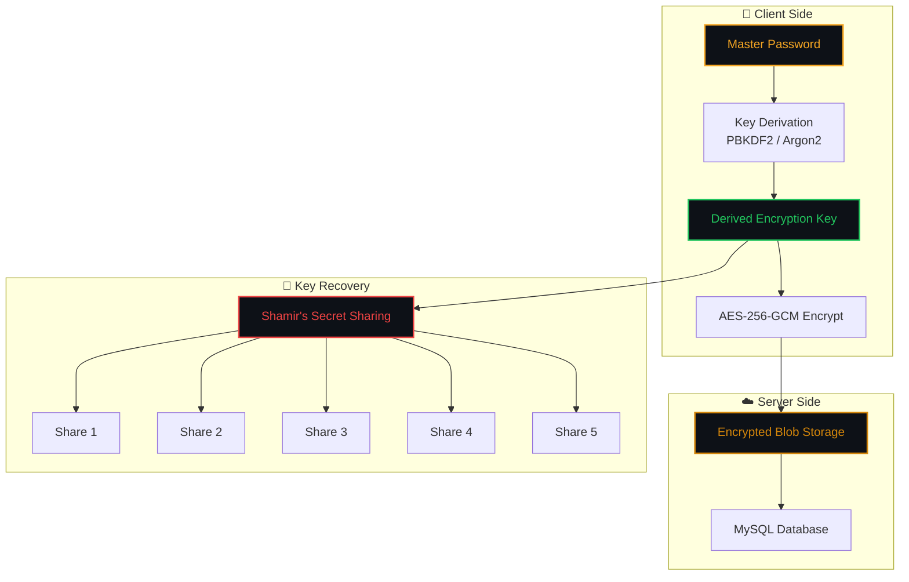
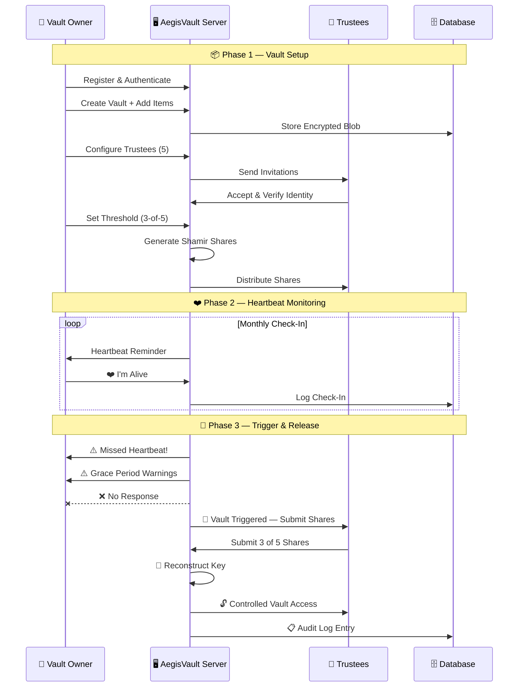

<!-- ═══════════════════════════════════════════════════════════════════════════════ -->
<!-- ░░░░░░░░░░░░░░░░░░░░░░░░░░ AEGISVAULT README ░░░░░░░░░░░░░░░░░░░░░░░░░░░░░ -->
<!-- ═══════════════════════════════════════════════════════════════════════════════ -->

<div align="center">

<!-- ╔═══════════════════════════════════════════════════════════════╗ -->
<!-- ║                    ANIMATED HEADER                           ║ -->
<!-- ╚═══════════════════════════════════════════════════════════════╝ -->


<br>

<!-- Animated Capsule Render Header -->


<!-- Animated Title -->


<br>

<!-- Animated Tagline -->


<br>

<!-- ╔═══════════════════════════════════════════════════════════════╗ -->
<!-- ║                       BADGES                                 ║ -->
<!-- ╚═══════════════════════════════════════════════════════════════╝ -->


<br>

<!-- Separator -->


</div>

<!-- ═══════════════════════════════════════════════════════════════════════════════ -->
<!-- ░░░░░░░░░░░░░░░░░░░░░░░░░ ABOUT THE PROJECT ░░░░░░░░░░░░░░░░░░░░░░░░░░░░░░ -->
<!-- ═══════════════════════════════════════════════════════════════════════════════ -->

##  &nbsp; About The Project

> **"Life is unpredictable. Your legacy shouldn't be."**

**AegisVault** is a secure digital inheritance platform built with Django that combines **military-grade encryption**, a **dead man's switch** mechanism, and **Shamir's Secret Sharing** to ensure your critical digital assets are safely passed to your trusted beneficiaries — only when the time is right.

Unlike traditional password managers, AegisVault doesn't just *store* your secrets — it ensures they **survive** you.

<br>

<div align="center">

```
╔══════════════════════════════════════════════════════════════════════╗
║                                                                      ║
║   📦 Store Securely  →  ❤️ Stay Active  →  🔔 We Safeguard  →  🔓 Legacy Lives  ║
║                                                                      ║
║   Encrypt and store      Check in              If you're inactive,    Your data is       ║
║   your important         periodically to       trusted people         released securely  ║
║   digital assets.        confirm you're        are notified.          to your chosen     ║
║                          active.                                      beneficiaries.     ║
║                                                                      ║
╚══════════════════════════════════════════════════════════════════════╝
```

</div>

<br>

<!-- ═══════════════════════════════════════════════════════════════════════════════ -->
<!-- ░░░░░░░░░░░░░░░░░░░░░░░░░░░ CORE CONCEPT ░░░░░░░░░░░░░░░░░░░░░░░░░░░░░░░░░ -->
<!-- ═══════════════════════════════════════════════════════════════════════════════ -->

##  &nbsp; The Core Concept

<div align="center">



</div>

<br>

<!-- ═══════════════════════════════════════════════════════════════════════════════ -->
<!-- ░░░░░░░░░░░░░░░░░░░░░░░░░ KEY FEATURES ░░░░░░░░░░░░░░░░░░░░░░░░░░░░░░░░░░░ -->
<!-- ═══════════════════════════════════════════════════════════════════════════════ -->

##  &nbsp; Key Features

<div align="center">
<table>
<tr>
<td width="50%" valign="top">

### 🔐 Military-Grade Vault
- AES-256-GCM encryption at rest
- Client-side key derivation
- Zero-knowledge architecture
- Encrypted passwords, documents, recovery codes, notes, and digital accounts

</td>
<td width="50%" valign="top">

### ❤️ Dead Man's Switch
- Configurable heartbeat intervals
- One-click "I'm Alive" check-in
- Multi-stage warning system
- Automatic state transitions

</td>
</tr>
<tr>
<td width="50%" valign="top">

### 🔑 Shamir's Secret Sharing
- Threshold-based key sharding (e.g., 3-of-5)
- Cryptographic share distribution
- Secure share verification
- Threshold reconstruction

</td>
<td width="50%" valign="top">

### 👥 Trustee Management
- Invite trusted beneficiaries
- Identity & email verification
- Granular permissions
- Share assignment & tracking

</td>
</tr>
<tr>
<td width="50%" valign="top">

### ⏳ Temporal State Machine
- Automatic vault lifecycle management
- Configurable grace periods
- Multi-stage transitions with validation
- Emergency cancellation support

</td>
<td width="50%" valign="top">

### 📋 Immutable Audit Trail
- Tamper-evident security logs
- Full event history with actor tracking
- Failed authentication monitoring
- Comprehensive security event recording

</td>
</tr>
</table>
</div>

<br>

<!-- Separator -->
<div align="center">

</div>

<br>

<!-- ═══════════════════════════════════════════════════════════════════════════════ -->
<!-- ░░░░░░░░░░░░░░░░░░░░░░░░░░ SYSTEM ARCHITECTURE ░░░░░░░░░░░░░░░░░░░░░░░░░░░░ -->
<!-- ═══════════════════════════════════════════════════════════════════════════════ -->

##  &nbsp; System Architecture

<div align="center">

```
                              ╔═══════════════════════════════════╗
                              ║        🛡️  A E G I S V A U L T    ║
                              ║     Secure Digital Inheritance     ║
                              ╚═══════════════╤═══════════════════╝
                                              │
                  ┌───────────────────────────┼───────────────────────────┐
                  │                           │                           │
          ╔═══════╧════════╗          ╔═══════╧════════╗          ╔═══════╧════════╗
          ║   👤 OWNER      ║          ║   🤝 TRUSTEE    ║          ║   🛠️ ADMIN      ║
          ║   Vault Control ║          ║   Shard Holder  ║          ║   Sys. Mgmt     ║
          ╚═══════╤════════╝          ╚═══════╤════════╝          ╚═══════╤════════╝
                  │                           │                           │
     ┌────────────┼────────────┐              │                  ┌────────┼────────┐
     │            │            │              │                  │        │        │
  ┌──┴──┐     ┌──┴──┐     ┌──┴──┐       ┌──┴──┐          ┌──┴──┐  ┌──┴──┐  ┌──┴──┐
  │Vault│     │Heart│     │Trust│       │Share│          │Users│  │Logs │  │Health│
  │Mgmt │     │beat │     │ee   │       │Mgmt │          │Mgmt │  │Audit│  │Check │
  └─────┘     └─────┘     └─────┘       └─────┘          └─────┘  └─────┘  └─────┘
```

</div>

<br>

<!-- ═══════════════════════════════════════════════════════════════════════════════ -->
<!-- ░░░░░░░░░░░░░░░░░░░░░░░░░ MODULE BREAKDOWN ░░░░░░░░░░░░░░░░░░░░░░░░░░░░░░░ -->
<!-- ═══════════════════════════════════════════════════════════════════════════════ -->

##  &nbsp; Complete Module Structure

> AegisVault is architected as a modular Django system with **15 interconnected modules** — each responsible for a critical layer of the inheritance pipeline.

<br>

<!-- ─────────────── MODULE 01 ─────────────── -->

<details>
<summary><b>01 &nbsp;🔐&nbsp; Authentication & Identity</b></summary>

<br>

Handles all user identity, account security, and session management.

| Feature | Description |
|---|---|
| User Registration | Secure account creation with validation |
| Login / Logout | Session-based authentication |
| Forgot & Reset Password | Email-verified password recovery |
| Email Verification | Account activation via email |
| MFA / OTP | Multi-factor authentication support |
| Session Management | Secure session handling & timeout |
| Account Lockout | Brute-force protection |
| Device / Login History | Track devices & login activity |

**Roles Supported:**

| Role | Responsibility |
|---|---|
| 👤 **Vault Owner** | Creates vault, stores encrypted assets, configures heartbeat and trustees |
| 🤝 **Trustee** | Receives a cryptographic shard, participates in vault recovery |
| 🛠️ **System Administrator** | Manages platform operations — **cannot decrypt user vaults** |

</details>

<!-- ─────────────── MODULE 02 ─────────────── -->

<details>
<summary><b>02 &nbsp;📋&nbsp; User Onboarding</b></summary>

<br>

Guided initial setup after registration.

| Feature | Description |
|---|---|
| Personal Profile | Name, contact information setup |
| Emergency Contact | Designate emergency contact person |
| Heartbeat Interval | Choose preferred check-in frequency |
| Grace Period Config | Set the window before vault triggers |
| Trustee Setup | Initial beneficiary configuration |
| Security Preferences | Configure 2FA, session settings |
| Recovery Configuration | Set up recovery codes and methods |

</details>

<!-- ─────────────── MODULE 03 ─────────────── -->

<details>
<summary><b>03 &nbsp;🔒&nbsp; Digital Vault</b></summary>

<br>

The core vault module — encrypted storage for all your critical digital assets.

| Feature | Description |
|---|---|
| Create Vault | Initialize a new encrypted vault |
| Add / Edit / Delete Items | Full CRUD for vault entries |
| Categorize Information | Organize by type |
| Vault Status | Active, locked, triggered states |
| Activity History | Full vault interaction log |

**Supported Asset Types:**
```
📁 My Vault
├── 📧 Email Accounts
├── 🏦 Banking Information
├── ☁️ Cloud Storage Credentials
├── 📄 Important Documents
├── 💰 Crypto Wallet Information
├── 🔑 Recovery Codes
├── 🔗 Access Links
└── 📝 Personal Messages & Notes
```

</details>

<!-- ─────────────── MODULE 04 ─────────────── -->

<details>
<summary><b>04 &nbsp;🛡️&nbsp; Encryption & Key Management</b></summary>

<br>


Military-grade protection for all vault data.

| Feature | Description |
|---|---|
| Client-Side Encryption | Data encrypted before transmission |
| AES-256-GCM | Authenticated encryption standard |
| Key Derivation | PBKDF2 / Argon2 based key derivation |
| Key Rotation | Periodic cryptographic key refresh |
| Secure Key Lifecycle | Generation → Usage → Rotation → Destruction |

> ⚠️ **Security Property:** The plaintext master key is **never** stored in the database. Keys are derived client-side and only encrypted forms touch the server.

</details>

<!-- ─────────────── MODULE 05 ─────────────── -->

<details>
<summary><b>05 &nbsp;🔑&nbsp; Secret Sharing / Sharding</b></summary>

<br>

One of AegisVault's **signature features** — threshold cryptography using Shamir's Secret Sharing.

```
                        🔐 Master Secret
                              │
                              ▼
                      Secret Sharing (SSS)
                              │
                 ┌────┬───────┼───────┬────┐
                 ▼    ▼       ▼       ▼    ▼
                S1   S2      S3      S4   S5
               Dad  Mom   Brother  Lawyer Executor
```

| Feature | Description |
|---|---|
| Generate Shares | Split master key into N shares |
| Assign Shares | Map shares to verified trustees |
| Distribute Securely | Encrypted share delivery |
| Share Verification | Validate share integrity |
| Threshold Validation | Enforce minimum share requirement |
| Secret Reconstruction | Rebuild key from K-of-N shares |

**Threshold Examples:**

| Shares Submitted | Status |
|---|---|
| `2 / 5` | 🔴 **LOCKED** — Below threshold |
| `3 / 5` | 🟢 **ELIGIBLE** — Meets threshold |
| `4 / 5` | 🟢 **ELIGIBLE** — Exceeds threshold |
| `5 / 5` | 🟢 **ELIGIBLE** — All shares submitted |

</details>

<!-- ─────────────── MODULE 06 ─────────────── -->

<details>
<summary><b>06 &nbsp;👥&nbsp; Trustee Management</b></summary>

<br>

Configure and manage trusted beneficiaries who will inherit your digital assets.

| Feature | Description |
|---|---|
| Add / Remove Trustee | Manage beneficiary list |
| Trustee Invitation | Email-based invitation system |
| Identity Verification | Multi-step identity confirmation |
| Trustee Permissions | Granular access controls |
| Share Management | Assign and track shard ownership |

**Example Configuration:**
```
👤 Vault Owner
│
├── 🤝 Trustee 1 — Father        [Share S1] ✅ Verified
├── 🤝 Trustee 2 — Mother        [Share S2] ✅ Verified
├── 🤝 Trustee 3 — Brother       [Share S3] ✅ Verified
├── 🤝 Trustee 4 — Lawyer        [Share S4] ✅ Verified
└── 🤝 Trustee 5 — Executor      [Share S5] ⏳ Pending
```

</details>

<!-- ─────────────── MODULE 07 ─────────────── -->

<details>
<summary><b>07 &nbsp;❤️&nbsp; Heartbeat / Check-In (Dead Man's Switch)</b></summary>

<br>


The Dead Man's Switch — the mechanism that keeps your vault active.

```
  ╔════════════════════════════════════════════════════════════════╗
  ║                        AEGISVAULT                              ║
  ║                                                                ║
  ║              N E X T   H E A R T B E A T                       ║
  ║                                                                ║
  ║           23 Days  ·  14 Hours  ·  32 Minutes                  ║
  ║                                                                ║
  ║                 ┌─────────────────────┐                        ║
  ║                 │    ❤️ I'M ALIVE     │                        ║
  ║                 └─────────────────────┘                        ║
  ║                                                                ║
  ╚════════════════════════════════════════════════════════════════╝
```

| Feature | Description |
|---|---|
| Monthly Heartbeat | Configurable check-in interval |
| Countdown Timer | Visual countdown to next heartbeat |
| One-Click Check-In | Simple "I'm Alive" confirmation |
| Missed Detection | Automatic missed-heartbeat flagging |
| Check-In History | Complete heartbeat log |

</details>

<!-- ─────────────── MODULE 08 ─────────────── -->

<details>
<summary><b>08 &nbsp;⏳&nbsp; Temporal State Machine</b></summary>

<br>

Controls automatic vault state transitions through a deterministic state machine.



| Feature | Description |
|---|---|
| State Management | Deterministic state transitions |
| Deadline Calculation | Automatic next-state scheduling |
| Grace Periods | Configurable buffer windows |
| Automatic Transitions | Time-driven state changes |
| Cancellation | Emergency override support |

</details>

<!-- ─────────────── MODULE 09 ─────────────── -->

<details>
<summary><b>09 &nbsp;📧&nbsp; Notification & Warning System</b></summary>

<br>

Multi-stage alert pipeline that keeps all parties informed.

```
  Timeline
  ━━━━━━━━━━━━━━━━━━━━━━━━━━━━━━━━━━━━━━━━━━━━━━━━━━━━━
  Day 28  │  📬 Heartbeat Reminder         → Owner
  Day 31  │  ⚠️ Missed Heartbeat Alert     → Owner
  Day 35  │  🔔 Warning #1                 → Owner
  Day 40  │  🔔 Warning #2                 → Owner
  Day 45  │  🚨 Final Warning              → Owner
  Day 50  │  💀 Trigger                    → Owner + Trustees
  ━━━━━━━━━━━━━━━━━━━━━━━━━━━━━━━━━━━━━━━━━━━━━━━━━━━━━
```

| Feature | Description |
|---|---|
| Heartbeat Reminders | Pre-deadline notifications |
| Missed Alerts | Immediate missed-heartbeat notice |
| Grace Warnings | Escalating urgency notifications |
| Trustee Notifications | Alert beneficiaries on trigger |
| Release Notifications | Vault unlock confirmations |

</details>

<!-- ─────────────── MODULE 10 ─────────────── -->

<details>
<summary><b>10 &nbsp;🚨&nbsp; Vault Release</b></summary>

<br>

Controls the critical post-trigger vault release process. The vault is **never** released on timer expiry alone.

```
  ┌─────────────────────┐
  │  Trigger Condition   │  Timer expired + state verified
  └──────────┬──────────┘
             │
             ▼
  ┌─────────────────────┐
  │ Trustee Auth         │  Each trustee authenticates
  └──────────┬──────────┘
             │
             ▼
  ┌─────────────────────┐
  │ Threshold Shares     │  K-of-N shares submitted
  └──────────┬──────────┘
             │
             ▼
  ┌─────────────────────┐
  │ 🔓 Vault Access      │  Controlled, audited release
  └─────────────────────┘
```

| Feature | Description |
|---|---|
| Trigger Verification | Multi-condition trigger validation |
| Release Authorization | Administrative approval workflow |
| Share Submission | Trustee shard submission portal |
| Threshold Checking | Real-time threshold verification |
| Controlled Access | Audited, time-limited vault access |

</details>

<!-- ─────────────── MODULE 11 ─────────────── -->

<details>
<summary><b>11 &nbsp;🪪&nbsp; Trustee Verification</b></summary>

<br>

Additional security layer for trustee identity confirmation.

| Feature | Description |
|---|---|
| Email Verification | Verified email ownership |
| OTP Verification | One-time password challenges |
| Identity Confirmation | Multi-step identity checks |
| Share Ownership Proof | Verify shard possession |
| Suspicious Activity Detection | Anomaly flagging |

</details>

<!-- ─────────────── MODULE 12 ─────────────── -->

<details>
<summary><b>12 &nbsp;📋&nbsp; Audit & Security Logs</b></summary>

<br>

Comprehensive, immutable-style audit trail — critical for a cybersecurity project.

**Tracked Events:**
```
LOGIN                  VAULT_CREATED          VAULT_ITEM_ADDED
HEARTBEAT_COMPLETED    HEARTBEAT_MISSED       STATE_CHANGED
TRUSTEE_ADDED          SHARE_SUBMITTED        RELEASE_TRIGGERED
VAULT_UNLOCKED         AUTH_FAILED            EMERGENCY_CANCEL
```

| Feature | Description |
|---|---|
| Immutable Records | Append-only audit entries |
| Timestamps | Precise UTC event timing |
| Actor Tracking | Who performed each action |
| Event Status | Success / Failure / Warning |
| Security Events | Failed auth, anomalies, breaches |

</details>

<!-- ─────────────── MODULE 13 ─────────────── -->

<details>
<summary><b>13 &nbsp;🆘&nbsp; Emergency Recovery</b></summary>

<br>

Allows the vault owner to regain control at any point before final release.

| Feature | Description |
|---|---|
| Emergency Cancel | **"I'm Alive — Cancel Release"** button |
| Recovery Codes | Pre-generated one-time recovery codes |
| Account Recovery | Full account restoration flow |
| Trustee Replacement | Swap compromised trustees |
| Key Rotation | Regenerate vault encryption keys |
| Revoke Release | Cancel a pending vault release |

> 💡 **The "I'm Alive — Cancel Release" feature** immediately halts the release process when the owner proves they are alive and active.

</details>

<!-- ─────────────── MODULE 14 ─────────────── -->

<details>
<summary><b>14 &nbsp;🛠️&nbsp; Admin / Security Operations</b></summary>

<br>

Platform administration for system administrators.

| Feature | Description |
|---|---|
| User Management | Account administration |
| Security Monitoring | Real-time security event feed |
| System Health | Platform health checks |
| Failed Login Monitoring | Brute-force detection |
| Audit Log Viewer | Searchable security log interface |

> 🔒 **Critical Security Property:** Administrators **cannot decrypt user vault contents**. This is a deliberate zero-knowledge design decision.

</details>

<!-- ─────────────── MODULE 15 ─────────────── -->

<details>
<summary><b>15 &nbsp;📊&nbsp; Dashboard & Analytics</b></summary>

<br>

**Owner Dashboard:**
```
  ┌─────────────────────────────────────────────────────┐
  │                  🛡️ AEGISVAULT                       │
  ├─────────────────────────────────────────────────────┤
  │                                                     │
  │  Vault Status ·········  🟢 ACTIVE                  │
  │                                                     │
  │  Next Heartbeat ·······  23 Days 14 Hours           │
  │                                                     │
  │              ┌───────────────────┐                   │
  │              │   ❤️ I'M ALIVE    │                   │
  │              └───────────────────┘                   │
  │                                                     │
  │  Trustees ·············  4 / 5 Configured            │
  │  Threshold ············  3 / 5 Required              │
  │  Vault Items ··········  18 Encrypted Items          │
  │  Last Check-In ········  Sep 01, 2026                │
  │                                                     │
  └─────────────────────────────────────────────────────┘
```

**Trustee Dashboard:**

| Widget | Description |
|---|---|
| Assigned Vaults | Vaults you are a trustee for |
| Trustee Status | Your verification status |
| Share Status | Your shard assignment |
| Pending Requests | Active release requests |
| Release Status | Current vault states |

</details>

<br>

<!-- Separator -->
<div align="center">

</div>

<br>

<!-- ═══════════════════════════════════════════════════════════════════════════════ -->
<!-- ░░░░░░░░░░░░░░░░░░░░░░░░░ MODULE HIERARCHY ░░░░░░░░░░░░░░░░░░░░░░░░░░░░░░░ -->
<!-- ═══════════════════════════════════════════════════════════════════════════════ -->

##  &nbsp; Module Hierarchy

<div align="center">

```
                          🛡️ A E G I S V A U L T
                          ═══════════════════════
                                    │
         ┌──────────────────────────┼──────────────────────────┐
         │                          │                          │
    ╔════╧════╗               ╔════╧════╗               ╔════╧════╗
    ║ IDENTITY ║               ║  VAULT   ║               ║ SYSTEM  ║
    ╚════╤════╝               ╚════╤════╝               ╚════╤════╝
         │                          │                          │
    ┌────┴────┐            ┌───────┼───────┐            ┌────┴────┐
    │         │            │       │       │            │         │
  01.Auth  02.Onboard   03.Vault 04.Crypto 05.Sharding 14.Admin 15.Dash
                           │       │
                      ┌────┴──┐    │
                      │       │    │
                   06.Trust 07.Heart 08.State
                      │              │
                   11.Verify    ┌────┴────┐
                               │         │
                            09.Notify 10.Release
                                         │
                                    ┌────┴────┐
                                    │         │
                                 12.Audit  13.Recovery
```

</div>

<br>

<!-- ═══════════════════════════════════════════════════════════════════════════════ -->
<!-- ░░░░░░░░░░░░░░░░░░░░░░░░░ SECURITY MODEL ░░░░░░░░░░░░░░░░░░░░░░░░░░░░░░░░░ -->
<!-- ═══════════════════════════════════════════════════════════════════════════════ -->

##  &nbsp; Security Model

<div align="center">



</div>

<br>

| Security Property | Implementation |
|---|---|
| 🔐 **Encryption at Rest** | AES-256-GCM with authenticated encryption |
| 🔑 **Key Derivation** | PBKDF2 / Argon2id with high iteration count |
| 🚫 **Zero-Knowledge** | Server never sees plaintext keys or data |
| 🔒 **Admin Isolation** | Admins cannot decrypt user vaults |
| 🛡️ **Threshold Crypto** | K-of-N secret sharing for key recovery |
| 📋 **Audit Trail** | Immutable, append-only security logs |
| 🔄 **Key Rotation** | Periodic cryptographic key refresh |
| 🛑 **Account Lockout** | Automatic lockout after failed attempts |

<br>

<!-- ═══════════════════════════════════════════════════════════════════════════════ -->
<!-- ░░░░░░░░░░░░░░░░░░░░░░░░░░░ TECH STACK ░░░░░░░░░░░░░░░░░░░░░░░░░░░░░░░░░░░ -->
<!-- ═══════════════════════════════════════════════════════════════════════════════ -->

##  &nbsp; Tech Stack

<div align="center">

| Layer | Technology | Purpose |
|:---:|:---:|:---:|
|  | Python | Core Language |
|  | Django | Web Framework |
|  | MySQL | Primary Database |
|  | HTML5 | Templates |
|  | CSS3 | Styling |
|  | JavaScript | Client Logic |
|  | PyCryptodome | Encryption Library |
|  | Celery | Task Queue |
|  | Redis | Cache & Broker |

</div>

<br>

<!-- ═══════════════════════════════════════════════════════════════════════════════ -->
<!-- ░░░░░░░░░░░░░░░░░░░░░░░░░░ GETTING STARTED ░░░░░░░░░░░░░░░░░░░░░░░░░░░░░░░ -->
<!-- ═══════════════════════════════════════════════════════════════════════════════ -->

##  &nbsp; Getting Started

### Prerequisites

```bash
# Python 3.12+
python --version

# MySQL 8.0+
mysql --version

# Redis (for Celery)
redis-server --version
```

### Installation

```bash
# 1. Clone the repository
git clone https://github.com/yourusername/AegisVault.git
cd AegisVault

# 2. Create virtual environment
python -m venv venv
source venv/bin/activate        # Linux/Mac
.\venv\Scripts\activate         # Windows

# 3. Install dependencies
pip install -r requirements.txt

# 4. Configure environment variables
cp .env.example .env
# Edit .env with your database credentials and secret key

# 5. Run migrations
python manage.py makemigrations
python manage.py migrate

# 6. Create superuser
python manage.py createsuperuser

# 7. Start the development server
python manage.py runserver
```

### Environment Variables

```env
# Django
SECRET_KEY=your-secret-key-here
DEBUG=True
ALLOWED_HOSTS=localhost,127.0.0.1

# Database
DB_NAME=aegisvault
DB_USER=root
DB_PASSWORD=your-password
DB_HOST=localhost
DB_PORT=3306

# Email
EMAIL_BACKEND=django.core.mail.backends.smtp.EmailBackend
EMAIL_HOST=smtp.gmail.com
EMAIL_PORT=587
EMAIL_USE_TLS=True
EMAIL_HOST_USER=your-email@gmail.com
EMAIL_HOST_PASSWORD=your-app-password

# Celery
CELERY_BROKER_URL=redis://localhost:6379/0
CELERY_RESULT_BACKEND=redis://localhost:6379/0
```

<br>

<!-- ═══════════════════════════════════════════════════════════════════════════════ -->
<!-- ░░░░░░░░░░░░░░░░░░░░░░░░░ PROJECT STRUCTURE ░░░░░░░░░░░░░░░░░░░░░░░░░░░░░░ -->
<!-- ═══════════════════════════════════════════════════════════════════════════════ -->

##  &nbsp; Project Structure

```
AegisVault/
│
├── 📁 aegisvault/                 # Project configuration
│   ├── settings.py
│   ├── urls.py
│   ├── celery.py
│   └── wsgi.py
│
├── 📁 authentication/             # 01. Auth & Identity Module
│   ├── models.py
│   ├── views.py
│   ├── forms.py
│   └── backends.py
│
├── 📁 onboarding/                 # 02. User Onboarding Module
│   ├── models.py
│   └── views.py
│
├── 📁 vault/                      # 03. Digital Vault Module
│   ├── models.py
│   ├── views.py
│   └── encryption.py
│
├── 📁 crypto/                     # 04. Encryption & Key Management
│   ├── aes.py
│   ├── key_derivation.py
│   └── key_rotation.py
│
├── 📁 sharding/                   # 05. Secret Sharing Module
│   ├── shamir.py
│   ├── share_manager.py
│   └── reconstruction.py
│
├── 📁 trustees/                   # 06. Trustee Management
│   ├── models.py
│   ├── views.py
│   └── verification.py
│
├── 📁 heartbeat/                  # 07. Heartbeat / Check-In
│   ├── models.py
│   ├── views.py
│   └── tasks.py                   # Celery tasks
│
├── 📁 state_machine/              # 08. Temporal State Machine
│   ├── states.py
│   ├── transitions.py
│   └── scheduler.py
│
├── 📁 notifications/              # 09. Notification Module
│   ├── models.py
│   ├── email.py
│   └── templates/
│
├── 📁 release/                    # 10. Vault Release Module
│   ├── models.py
│   ├── views.py
│   └── threshold.py
│
├── 📁 trustee_verification/       # 11. Trustee Verification
│   ├── models.py
│   └── views.py
│
├── 📁 audit/                      # 12. Audit & Security Logs
│   ├── models.py
│   ├── middleware.py
│   └── signals.py
│
├── 📁 recovery/                   # 13. Emergency Recovery
│   ├── models.py
│   └── views.py
│
├── 📁 admin_ops/                  # 14. Admin Operations
│   ├── views.py
│   └── dashboard.py
│
├── 📁 dashboard/                  # 15. Dashboard & Analytics
│   ├── views.py
│   └── widgets.py
│
├── 📁 templates/                  # HTML Templates
├── 📁 static/                     # Static Assets
├── 📁 assets/images/              # README Assets
├── 📄 manage.py
├── 📄 requirements.txt
├── 📄 .env.example
└── 📄 README.md
```

<br>

<!-- ═══════════════════════════════════════════════════════════════════════════════ -->
<!-- ░░░░░░░░░░░░░░░░░░░░░░░░░░░ CORE FLOW ░░░░░░░░░░░░░░░░░░░░░░░░░░░░░░░░░░░░ -->
<!-- ═══════════════════════════════════════════════════════════════════════════════ -->

##  &nbsp; End-to-End Flow

<div align="center">



</div>

<br>

<!-- Separator -->
<div align="center">

</div>

<br>

<!-- ═══════════════════════════════════════════════════════════════════════════════ -->
<!-- ░░░░░░░░░░░░░░░░░░░░░░░░░░░░ ROLES ░░░░░░░░░░░░░░░░░░░░░░░░░░░░░░░░░░░░░░░ -->
<!-- ═══════════════════════════════════════════════════════════════════════════════ -->

##  &nbsp; User Roles

<div align="center">

```
                              🛡️ AEGISVAULT
                                    │
                 ┌──────────────────┼──────────────────┐
                 ▼                  ▼                  ▼
           ╔══════════╗      ╔══════════╗       ╔══════════╗
           ║  👤 OWNER ║      ║ 🤝 TRUSTEE║       ║ 🛠️ ADMIN ║
           ╚════╤═════╝      ╚════╤═════╝       ╚════╤═════╝
                │                  │                   │
           Vault Control      Shard Holder       System Management
                │                  │                   │
        ┌───────┤               ┌──┤               ┌───┤
        │       │               │  │               │   │
      Create  Configure      Hold Share       Monitor  Audit
      Vault   Heartbeat      Submit Shard     Security  Logs
      Items   & Trustees     on Trigger       Events   Health
```

</div>

<br>

| Role | Access Level | Can Decrypt Vaults? |
|:---:|:---:|:---:|
| 👤 **Vault Owner** | Full vault control, heartbeat, trustee management | ✅ Own vault only |
| 🤝 **Trustee** | Share management, release participation | 🔑 Only via threshold reconstruction |
| 🛠️ **Admin** | Platform operations, user/security management | ❌ **Never** |

<br>

<!-- ═══════════════════════════════════════════════════════════════════════════════ -->
<!-- ░░░░░░░░░░░░░░░░░░░░░░░░░ IMPLEMENTATION SCOPE ░░░░░░░░░░░░░░░░░░░░░░░░░░░░ -->
<!-- ═══════════════════════════════════════════════════════════════════════════════ -->

## 🎯 &nbsp; Implementation Scope

> For the college implementation, the core demo revolves around this end-to-end pipeline:

<div align="center">


</div>

This gives a **complete end-to-end story** — making AegisVault substantially more than a standard Django CRUD project.

<br>

<!-- ═══════════════════════════════════════════════════════════════════════════════ -->
<!-- ░░░░░░░░░░░░░░░░░░░░░░░░░░ CONTRIBUTING ░░░░░░░░░░░░░░░░░░░░░░░░░░░░░░░░░░ -->
<!-- ═══════════════════════════════════════════════════════════════════════════════ -->

## 🤝 &nbsp; Contributing

Contributions are welcome! Here's how to get started:

```bash
# 1. Fork the repository
# 2. Create a feature branch
git checkout -b feature/amazing-feature

# 3. Commit your changes
git commit -m "feat: add amazing feature"

# 4. Push to the branch
git push origin feature/amazing-feature

# 5. Open a Pull Request
```

<br>

<!-- ═══════════════════════════════════════════════════════════════════════════════ -->
<!-- ░░░░░░░░░░░░░░░░░░░░░░░░░░░░ LICENSE ░░░░░░░░░░░░░░░░░░░░░░░░░░░░░░░░░░░░░ -->
<!-- ═══════════════════════════════════════════════════════════════════════════════ -->

## 📄 &nbsp; License

This project is licensed under the **MIT License** — see the [LICENSE](LICENSE) file for details.

<br>

<!-- ═══════════════════════════════════════════════════════════════════════════════ -->
<!-- ░░░░░░░░░░░░░░░░░░░░░░░░░░░ ACKNOWLEDGMENTS ░░░░░░░░░░░░░░░░░░░░░░░░░░░░░░ -->
<!-- ═══════════════════════════════════════════════════════════════════════════════ -->

## 🙏 &nbsp; Acknowledgments

- **[Shamir's Secret Sharing](https://en.wikipedia.org/wiki/Shamir%27s_secret_sharing)** — Adi Shamir's threshold cryptography scheme
- **[AES-256-GCM](https://en.wikipedia.org/wiki/Galois/Counter_Mode)** — Authenticated encryption standard
- **[Django](https://www.djangoproject.com/)** — The web framework for perfectionists with deadlines
- **[PyCryptodome](https://pycryptodome.readthedocs.io/)** — Cryptographic library for Python

<br>

<!-- ═══════════════════════════════════════════════════════════════════════════════ -->
<!-- ░░░░░░░░░░░░░░░░░░░░░░░░░░░░ CONTACT ░░░░░░░░░░░░░░░░░░░░░░░░░░░░░░░░░░░░░ -->
<!-- ═══════════════════════════════════════════════════════════════════════════════ -->

## 📬 &nbsp; Contact

<div align="center">

[](https://github.com/yourusername)
[](mailto:your.email@gmail.com)
[](https://linkedin.com/in/yourprofile)

</div>

<br>

<!-- Footer Wave -->


<div align="center">

<br>

**Built with 🔐 for the people who plan ahead.**

*"A safer tomorrow is a kinder today."*

<br>


</div>
