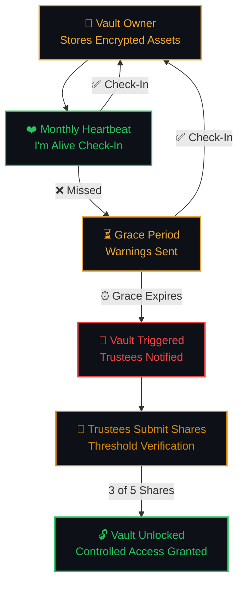
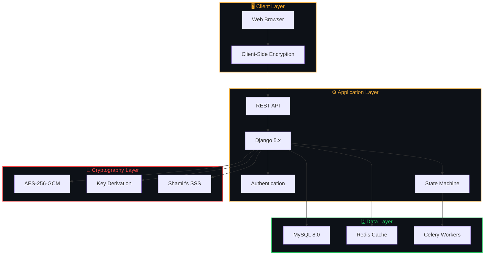
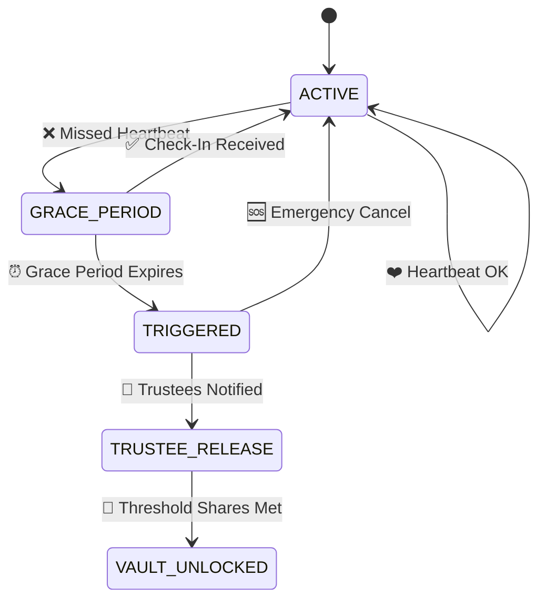
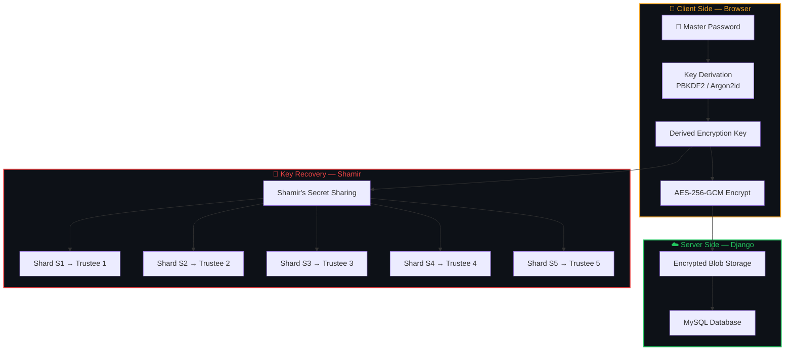
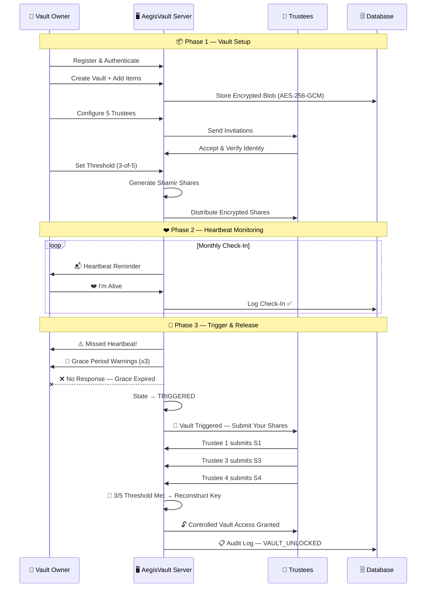

<!-- ═══════════════════════════════════════════════════════════════════════════════ -->
<!-- ░░░░░░░░░░░░░░░░░░░░░░░░░░ AEGISVAULT README ░░░░░░░░░░░░░░░░░░░░░░░░░░░░░ -->
<!-- ═══════════════════════════════════════════════════════════════════════════════ -->

<div align="center">

<!-- Capsule Render Top Wave -->


<br>

<!-- Banner Image — constrained width -->


<br><br>

<!-- Animated Typing Taglines -->
<a href="#-about-the-project">

</a>
<br>
<a href="#-the-core-concept">

</a>

<br><br>

<!-- ═════════ BADGES ROW 1 — Tech Stack ═════════ -->


<!-- ═════════ BADGES ROW 2 — Security ═════════ -->


<!-- ═════════ BADGES ROW 3 — Status ═════════ -->


<br>

<!-- Animated Separator -->


<br>

<!-- Quick Stats Bar -->

&nbsp;

&nbsp;

&nbsp;

&nbsp;


</div>

<br>

<!-- ═══════════════════════════════════════════════════════════════════════════════ -->
<!--                              ABOUT THE PROJECT                                -->
<!-- ═══════════════════════════════════════════════════════════════════════════════ -->

##  &nbsp; About The Project

<table>
<tr>
<td>

> *"Life is unpredictable. Your legacy shouldn't be."*

**AegisVault** is a **secure digital inheritance platform** built with Django that combines **military-grade encryption**, a **dead man's switch** mechanism, and **Shamir's Secret Sharing** to ensure your critical digital assets are safely passed to your trusted beneficiaries — only when the time is right.

Unlike traditional password managers, AegisVault doesn't just *store* your secrets — it ensures they **survive** you.

From important documents to cherished memories, AegisVault keeps your digital world secure and accessible to your loved ones — **always**.

</td>
</tr>
</table>

<br>

<div align="center">

### 📦 How It Works — A Simple Process, A Lasting Impact

<table>
<tr>
<td align="center" width="25%">
<br>
<br><br>
<b>🔒 Store Securely</b><br><br>
<sub>Encrypt and store your important digital assets with AES-256-GCM encryption.</sub>
<br><br>
</td>
<td align="center" width="25%">
<br>
<br><br>
<b>❤️ Stay Active</b><br><br>
<sub>Check in periodically to confirm you're active. One click — that's all it takes.</sub>
<br><br>
</td>
<td align="center" width="25%">
<br>
<br><br>
<b>🔔 We Safeguard</b><br><br>
<sub>If you're inactive, trusted people are notified through multi-stage warnings.</sub>
<br><br>
</td>
<td align="center" width="25%">
<br>
<br><br>
<b>🔓 Legacy Lives</b><br><br>
<sub>Your data is released securely to chosen beneficiaries via threshold crypto.</sub>
<br><br>
</td>
</tr>
</table>

</div>

<br>

<!-- Separator -->
<div align="center">

</div>

<br>

<!-- ═══════════════════════════════════════════════════════════════════════════════ -->
<!--                               CORE CONCEPT                                    -->
<!-- ═══════════════════════════════════════════════════════════════════════════════ -->

##  &nbsp; The Core Concept

<div align="center">



</div>

<br>

<!-- ═══════════════════════════════════════════════════════════════════════════════ -->
<!--                                KEY FEATURES                                   -->
<!-- ═══════════════════════════════════════════════════════════════════════════════ -->

##  &nbsp; Key Features

<div align="center">
<table>
<tr>
<td width="50%" valign="top">

### 🔐 &nbsp; Military-Grade Vault
> *Your data stays private with AES-256 encryption. Not even we can access it.*
- AES-256-GCM authenticated encryption at rest
- Client-side key derivation (PBKDF2 / Argon2)
- Zero-knowledge architecture
- Encrypted passwords, documents, recovery codes, notes & digital accounts

</td>
<td width="50%" valign="top">

### ❤️ &nbsp; Dead Man's Switch
> *A simple monthly heartbeat keeps your vault active.*
- Configurable heartbeat intervals (weekly, monthly, custom)
- One-click **"I'm Alive"** check-in button
- Multi-stage escalating warning system
- Automatic state transitions on inactivity

</td>
</tr>
<tr>
<td width="50%" valign="top">

### 🔑 &nbsp; Threshold Secret Sharing
> *Choose people you trust. Set a threshold for access (e.g., 3 of 5).*
- Shamir's Secret Sharing (K-of-N threshold)
- Cryptographic share distribution to trustees
- Secure share verification & validation
- Reconstruction only when threshold is met

</td>
<td width="50%" valign="top">

### 👥 &nbsp; Trusted Beneficiaries
> *Your digital legacy is passed securely to your chosen people.*
- Invite trustees via email with verification
- Multi-step identity confirmation
- Granular per-trustee permissions
- Real-time share assignment & tracking

</td>
</tr>
<tr>
<td width="50%" valign="top">

### ⏳ &nbsp; Temporal State Machine
> *Intelligent lifecycle that transitions only when conditions are met.*
- Deterministic state transitions (ACTIVE → GRACE → TRIGGERED → RELEASED)
- Configurable grace periods and deadlines
- Emergency cancellation & override support
- State validation at every transition

</td>
<td width="50%" valign="top">

### 📋 &nbsp; Immutable Audit Trail
> *Every action recorded. Every event timestamped. Tamper-evident.*
- Append-only, tamper-evident security logs
- Full event history with actor tracking
- Failed authentication monitoring
- Comprehensive security event classification

</td>
</tr>
</table>
</div>

<br>

<!-- Separator -->
<div align="center">

</div>

<br>

<!-- ═══════════════════════════════════════════════════════════════════════════════ -->
<!--                            SYSTEM ARCHITECTURE                                -->
<!-- ═══════════════════════════════════════════════════════════════════════════════ -->

##  &nbsp; System Architecture

<div align="center">



</div>

<br>

<div align="center">

```
  ┌──────────────────────────────────────────────────────────────────────┐
  │                       🛡️  ROLE HIERARCHY                            │
  ├──────────────────────────────────────────────────────────────────────┤
  │                                                                      │
  │                          AEGISVAULT                                   │
  │                              │                                        │
  │               ┌──────────────┼──────────────┐                         │
  │               ▼              ▼              ▼                         │
  │          ╔═════════╗   ╔═════════╗   ╔═════════╗                     │
  │          ║ 👤 OWNER ║   ║🤝TRUSTEE║   ║ 🛠️ ADMIN║                     │
  │          ╚════╤════╝   ╚════╤════╝   ╚════╤════╝                     │
  │               │              │              │                         │
  │          Vault Control   Shard Holder   System Mgmt                   │
  │          Heartbeat       Submit Share   Security Ops                   │
  │          Trustees        On Trigger     Audit Logs                     │
  │                                         ⛔ No Decrypt                 │
  │                                                                      │
  └──────────────────────────────────────────────────────────────────────┘
```

</div>

<br>

<!-- Separator -->
<div align="center">

</div>

<br>

<!-- ═══════════════════════════════════════════════════════════════════════════════ -->
<!--                           COMPLETE MODULE STRUCTURE                            -->
<!-- ═══════════════════════════════════════════════════════════════════════════════ -->

##  &nbsp; Complete Module Structure

> AegisVault is architected as a modular Django system with **15 interconnected modules** — each responsible for a critical layer of the inheritance pipeline.

<div align="center">

```
                          ╔═══════════════════════════════╗
                          ║     🛡️ A E G I S V A U L T    ║
                          ╚══════════════╤════════════════╝
                                         │
         ┌───────────────────────────────┼───────────────────────────────┐
         │                               │                               │
    ╔════╧═════╗                   ╔════╧═════╗                   ╔════╧═════╗
    ║ IDENTITY  ║                   ║   VAULT   ║                   ║  SYSTEM   ║
    ╚════╤═════╝                   ╚════╤═════╝                   ╚════╤═════╝
         │                               │                               │
    ┌────┴────┐              ┌──────────┼──────────┐              ┌────┴────┐
    │         │              │          │          │              │         │
  01.Auth  02.Onboard    03.Vault  04.Crypto  05.Sharing    14.Admin  15.Dash
                              │          │
                         ┌────┴───┐      │
                         │        │      │
                      06.Trust  07.Heart 08.State
                         │               │
                      11.Verify    ┌─────┴─────┐
                                   │           │
                               09.Notify   10.Release
                                               │
                                          ┌────┴────┐
                                          │         │
                                       12.Audit  13.Recovery
```

</div>

<br>

<!-- ─────────────── MODULE 01 ─────────────── -->

<details>
<summary>

### &nbsp; `01` &nbsp; 🔐 &nbsp; Authentication & Identity Module

</summary>

<br>

> Handles all user identity, account security, and session management.

| Feature | Description |
|:---|:---|
| 🔹 User Registration | Secure account creation with input validation |
| 🔹 Login / Logout | Session-based authentication with CSRF protection |
| 🔹 Forgot & Reset Password | Email-verified password recovery flow |
| 🔹 Email Verification | Account activation via verification email |
| 🔹 MFA / OTP | Multi-factor authentication with TOTP support |
| 🔹 Session Management | Secure session handling, timeout, and rotation |
| 🔹 Account Lockout | Automatic lockout after N failed attempts |
| 🔹 Device / Login History | Track devices, IPs, and login timestamps |

**User Roles:**

| Role | Access | Can Decrypt? |
|:---:|:---|:---:|
| 👤 **Vault Owner** | Full vault control, heartbeat, trustee management | ✅ Own vault |
| 🤝 **Trustee** | Share management, release participation | 🔑 Threshold only |
| 🛠️ **Admin** | Platform operations, security management | ❌ **Never** |

</details>

<!-- ─────────────── MODULE 02 ─────────────── -->

<details>
<summary>

### &nbsp; `02` &nbsp; 📋 &nbsp; User Onboarding Module

</summary>

<br>

> Guided initial setup flow after registration.

| Feature | Description |
|:---|:---|
| 🔹 Personal Profile | Name, avatar, contact information |
| 🔹 Emergency Contact | Designate an emergency contact person |
| 🔹 Heartbeat Interval | Choose preferred check-in frequency |
| 🔹 Grace Period Config | Set the window before vault triggers |
| 🔹 Trustee Setup | Initial beneficiary configuration wizard |
| 🔹 Security Preferences | Configure 2FA, session policies |
| 🔹 Recovery Configuration | Generate and store recovery codes |

</details>

<!-- ─────────────── MODULE 03 ─────────────── -->

<details>
<summary>

### &nbsp; `03` &nbsp; 🔒 &nbsp; Digital Vault Module

</summary>

<br>

> The core AegisVault module — encrypted storage for all critical digital assets.

| Feature | Description |
|:---|:---|
| 🔹 Create Vault | Initialize a new AES-256 encrypted vault |
| 🔹 Add / Edit / Delete Items | Full CRUD with real-time encryption |
| 🔹 Categorize Information | Organize by type and priority |
| 🔹 Vault Status | Active, locked, triggered, released states |
| 🔹 Activity History | Full vault interaction audit log |

**Supported Asset Types:**
```
📁 My Vault
│
├── 📧 Email Accounts
├── 🏦 Banking Information
├── ☁️  Cloud Storage Credentials
├── 📄 Important Documents
├── 💰 Crypto Wallet Information
├── 🔑 Recovery Codes
├── 🔗 Access Links
└── 📝 Personal Messages & Notes
```

</details>

<!-- ─────────────── MODULE 04 ─────────────── -->

<details>
<summary>

### &nbsp; `04` &nbsp; 🛡️ &nbsp; Encryption & Key Management Module

</summary>

<br>

<div align="center">

</div>

<br>

> Military-grade protection for all vault data.

| Feature | Description |
|:---|:---|
| 🔹 Client-Side Encryption | Data encrypted in the browser before transmission |
| 🔹 AES-256-GCM | Authenticated encryption — NIST standard |
| 🔹 Key Derivation | PBKDF2 / Argon2id with high iteration count |
| 🔹 Key Rotation | Periodic cryptographic key refresh |
| 🔹 Secure Key Lifecycle | Generation → Usage → Rotation → Destruction |

> ⚠️ **Critical Security Property:** The plaintext master key is **never** stored in the database. Keys are derived client-side — only encrypted blobs touch the server.

</details>

<!-- ─────────────── MODULE 05 ─────────────── -->

<details>
<summary>

### &nbsp; `05` &nbsp; 🔑 &nbsp; Secret Sharing / Sharding Module

</summary>

<br>

> One of AegisVault's **signature features** — threshold cryptography via Shamir's Secret Sharing.

```
                          🔐 Master Secret
                                │
                                ▼
                       ╔════════════════╗
                       ║ Shamir's  SSS  ║
                       ╚═══════╤════════╝
                               │
              ┌────────┬───────┼───────┬────────┐
              ▼        ▼       ▼       ▼        ▼
           ╔═════╗ ╔═════╗ ╔═════╗ ╔═════╗ ╔═════╗
           ║ S1  ║ ║ S2  ║ ║ S3  ║ ║ S4  ║ ║ S5  ║
           ╚═════╝ ╚═════╝ ╚═════╝ ╚═════╝ ╚═════╝
            Father  Mother  Brother  Lawyer  Executor
```

| Feature | Description |
|:---|:---|
| 🔹 Generate Shares | Split master key into N cryptographic shares |
| 🔹 Assign Shares | Map shares to verified trustees |
| 🔹 Secure Distribution | Encrypted share delivery to trustees |
| 🔹 Share Verification | Validate share integrity before storage |
| 🔹 Threshold Validation | Enforce minimum share requirement (K-of-N) |
| 🔹 Secret Reconstruction | Rebuild key when threshold is satisfied |

**Threshold Matrix:**

| Shares Submitted | Threshold (3/5) | Status |
|:---:|:---:|:---:|
| `2 / 5` | ❌ Below | 🔴 **LOCKED** |
| `3 / 5` | ✅ Met | 🟢 **ELIGIBLE** |
| `4 / 5` | ✅ Exceeded | 🟢 **ELIGIBLE** |
| `5 / 5` | ✅ Complete | 🟢 **ELIGIBLE** |

</details>

<!-- ─────────────── MODULE 06 ─────────────── -->

<details>
<summary>

### &nbsp; `06` &nbsp; 👥 &nbsp; Trustee Management Module

</summary>

<br>

> Configure and manage trusted beneficiaries who will inherit your digital assets.

| Feature | Description |
|:---|:---|
| 🔹 Add / Remove Trustee | Full trustee lifecycle management |
| 🔹 Invitation System | Email-based invite with unique tokens |
| 🔹 Identity Verification | Multi-step identity confirmation |
| 🔹 Trustee Permissions | Granular per-trustee access controls |
| 🔹 Share Management | Assign, track, and revoke shard ownership |

```
  👤 Vault Owner
  │
  ├── 🤝 Trustee 1 — Father      ── [Share S1] ── ✅ Verified
  ├── 🤝 Trustee 2 — Mother      ── [Share S2] ── ✅ Verified
  ├── 🤝 Trustee 3 — Brother     ── [Share S3] ── ✅ Verified
  ├── 🤝 Trustee 4 — Lawyer      ── [Share S4] ── ✅ Verified
  └── 🤝 Trustee 5 — Executor    ── [Share S5] ── ⏳ Pending
```

</details>

<!-- ─────────────── MODULE 07 ─────────────── -->

<details>
<summary>

### &nbsp; `07` &nbsp; ❤️ &nbsp; Heartbeat / Check-In Module — Dead Man's Switch

</summary>

<br>

<div align="center">

</div>

<br>

> The heartbeat is AegisVault's **Dead Man's Switch** — the mechanism that keeps your vault active.

```
  ╔═══════════════════════════════════════════════════════════╗
  ║                    🛡️ AEGISVAULT                          ║
  ║                                                           ║
  ║             ── NEXT HEARTBEAT ──                          ║
  ║                                                           ║
  ║          23 Days  ·  14 Hours  ·  32 Minutes              ║
  ║                                                           ║
  ║                ╔══════════════════╗                        ║
  ║                ║   ❤️ I'M ALIVE   ║                        ║
  ║                ╚══════════════════╝                        ║
  ║                                                           ║
  ║   Last Check-In: Sep 01, 2026  ·  Status: 🟢 ACTIVE      ║
  ╚═══════════════════════════════════════════════════════════╝
```

| Feature | Description |
|:---|:---|
| 🔹 Monthly Heartbeat | Configurable check-in interval |
| 🔹 Countdown Timer | Visual countdown to next required heartbeat |
| 🔹 One-Click Check-In | Simple "I'm Alive" confirmation button |
| 🔹 Missed Detection | Automatic missed-heartbeat detection & flagging |
| 🔹 Check-In History | Complete heartbeat log with timestamps |

</details>

<!-- ─────────────── MODULE 08 ─────────────── -->

<details>
<summary>

### &nbsp; `08` &nbsp; ⏳ &nbsp; Temporal State Machine Module

</summary>

<br>

> Controls automatic vault state transitions through a deterministic finite state machine.



| Feature | Description |
|:---|:---|
| 🔹 State Management | Deterministic transitions with full validation |
| 🔹 Deadline Calculation | Automatic next-state scheduling |
| 🔹 Grace Periods | Configurable buffer windows before triggering |
| 🔹 Auto Transitions | Time-driven state changes via Celery tasks |
| 🔹 Emergency Cancel | Owner can halt release at any time |

</details>

<!-- ─────────────── MODULE 09 ─────────────── -->

<details>
<summary>

### &nbsp; `09` &nbsp; 📧 &nbsp; Notification & Warning Module

</summary>

<br>

> Multi-stage alert pipeline that keeps all parties informed before anything happens.

```
  ━━━━━━━━━━━━━━ NOTIFICATION TIMELINE ━━━━━━━━━━━━━━━━
  
  Day 28  │  📬  Heartbeat Reminder          → 👤 Owner
  Day 31  │  ⚠️  Missed Heartbeat Alert      → 👤 Owner
  Day 35  │  🔔  Warning #1                  → 👤 Owner
  Day 40  │  🔔  Warning #2 (Escalated)      → 👤 Owner
  Day 45  │  🚨  FINAL Warning               → 👤 Owner
  Day 50  │  💀  Vault Triggered             → 👤 Owner + 🤝 Trustees
  
  ━━━━━━━━━━━━━━━━━━━━━━━━━━━━━━━━━━━━━━━━━━━━━━━━━━━━
```

| Feature | Description |
|:---|:---|
| 🔹 Heartbeat Reminders | Pre-deadline notifications to owner |
| 🔹 Missed Alerts | Immediate missed-heartbeat notice |
| 🔹 Grace Warnings | Escalating urgency notifications |
| 🔹 Trustee Alerts | Notify beneficiaries when vault triggers |
| 🔹 Release Notifications | Vault unlock confirmations to all parties |

</details>

<!-- ─────────────── MODULE 10 ─────────────── -->

<details>
<summary>

### &nbsp; `10` &nbsp; 🚨 &nbsp; Vault Release Module

</summary>

<br>

> The vault is **never** released on timer expiry alone. Multiple conditions must be met.

```
  ┌─────────────────────────────┐
  │  ⏰ Trigger Condition        │  Timer expired + state verified
  └──────────────┬──────────────┘
                 │
                 ▼
  ┌─────────────────────────────┐
  │  🪪 Trustee Authentication   │  Each trustee proves identity
  └──────────────┬──────────────┘
                 │
                 ▼
  ┌─────────────────────────────┐
  │  🔑 Threshold Shares         │  K-of-N shares submitted & verified
  └──────────────┬──────────────┘
                 │
                 ▼
  ┌─────────────────────────────┐
  │  🔓 Vault Access             │  Controlled, audited, time-limited
  └─────────────────────────────┘
```

| Feature | Description |
|:---|:---|
| 🔹 Trigger Verification | Multi-condition trigger validation |
| 🔹 Release Authorization | Administrative approval workflow |
| 🔹 Share Submission | Trustee shard submission portal |
| 🔹 Threshold Checking | Real-time K-of-N threshold verification |
| 🔹 Controlled Access | Audited, time-limited vault access window |

</details>

<!-- ─────────────── MODULE 11 ─────────────── -->

<details>
<summary>

### &nbsp; `11` &nbsp; 🪪 &nbsp; Trustee Verification Module

</summary>

<br>

> Adds an additional security layer for trustee identity confirmation during release.

| Feature | Description |
|:---|:---|
| 🔹 Email Verification | Verified email ownership proof |
| 🔹 OTP Challenge | One-time password verification |
| 🔹 Identity Confirmation | Multi-step identity validation |
| 🔹 Share Ownership Proof | Cryptographic shard possession verification |
| 🔹 Anomaly Detection | Suspicious activity flagging |

</details>

<!-- ─────────────── MODULE 12 ─────────────── -->

<details>
<summary>

### &nbsp; `12` &nbsp; 📋 &nbsp; Audit & Security Logs Module

</summary>

<br>

> Comprehensive, immutable-style audit trail — critical for a cybersecurity project.

**Tracked Security Events:**

| Event | Category |
|:---|:---|
| `LOGIN` / `LOGOUT` | 🔐 Authentication |
| `AUTH_FAILED` | 🔐 Authentication |
| `VAULT_CREATED` / `VAULT_ITEM_ADDED` | 🔒 Vault |
| `HEARTBEAT_COMPLETED` / `HEARTBEAT_MISSED` | ❤️ Heartbeat |
| `STATE_CHANGED` | ⏳ State Machine |
| `TRUSTEE_ADDED` / `SHARE_SUBMITTED` | 👥 Trustees |
| `RELEASE_TRIGGERED` / `VAULT_UNLOCKED` | 🚨 Release |
| `EMERGENCY_CANCEL` | 🆘 Recovery |

| Feature | Description |
|:---|:---|
| 🔹 Immutable Records | Append-only audit entries (no edits, no deletes) |
| 🔹 Timestamps | Precise UTC event timing |
| 🔹 Actor Tracking | Who performed each action (user, system, celery) |
| 🔹 Event Status | Success / Failure / Warning classification |
| 🔹 Security Events | Failed auth attempts, anomalies, breaches |

</details>

<!-- ─────────────── MODULE 13 ─────────────── -->

<details>
<summary>

### &nbsp; `13` &nbsp; 🆘 &nbsp; Emergency Recovery Module

</summary>

<br>

> Allows the vault owner to regain control at any point before final release.

| Feature | Description |
|:---|:---|
| 🔹 Emergency Cancel | **"I'm Alive — Cancel Release"** instant override |
| 🔹 Recovery Codes | Pre-generated one-time recovery codes |
| 🔹 Account Recovery | Full account restoration flow |
| 🔹 Trustee Replacement | Swap compromised trustees + re-shard |
| 🔹 Key Rotation | Regenerate vault encryption keys |
| 🔹 Revoke Release | Cancel a pending vault release |

> 💡 The **"I'm Alive — Cancel Release"** feature immediately halts the release process when the owner proves they are alive and active.

</details>

<!-- ─────────────── MODULE 14 ─────────────── -->

<details>
<summary>

### &nbsp; `14` &nbsp; 🛠️ &nbsp; Admin / Security Operations Module

</summary>

<br>

> Platform administration for system administrators.

| Feature | Description |
|:---|:---|
| 🔹 User Management | Account administration & suspension |
| 🔹 Security Monitoring | Real-time security event dashboard |
| 🔹 System Health | Platform health checks & uptime |
| 🔹 Failed Login Monitoring | Brute-force detection & alerting |
| 🔹 Audit Log Viewer | Searchable, filterable security log interface |

> 🔒 **Zero-Knowledge Guarantee:** Administrators **cannot decrypt user vault contents** — by design. This is a deliberate architectural decision, not a limitation.

</details>

<!-- ─────────────── MODULE 15 ─────────────── -->

<details>
<summary>

### &nbsp; `15` &nbsp; 📊 &nbsp; Dashboard & Analytics Module

</summary>

<br>

**Owner Dashboard:**
```
  ┌─────────────────────────────────────────────────────────────┐
  │                     🛡️ AEGISVAULT                            │
  ├─────────────────────────────────────────────────────────────┤
  │                                                             │
  │  Vault Status ············  🟢 ACTIVE                       │
  │                                                             │
  │  Next Heartbeat ··········  23 Days · 14 Hours              │
  │                                                             │
  │              ╔══════════════════════╗                        │
  │              ║    ❤️ I'M ALIVE      ║                        │
  │              ╚══════════════════════╝                        │
  │                                                             │
  │  Trustees ·················  4 / 5 Configured               │
  │  Threshold ················  3 / 5 Required                 │
  │  Vault Items ··············  18 Encrypted Items             │
  │  Last Check-In ············  Sep 01, 2026                   │
  │                                                             │
  └─────────────────────────────────────────────────────────────┘
```

**Trustee Dashboard:**

| Widget | Description |
|:---|:---|
| 🔹 Assigned Vaults | Vaults you are a trustee for |
| 🔹 Trustee Status | Your verification & activation status |
| 🔹 Share Status | Your shard assignment & integrity |
| 🔹 Pending Requests | Active release requests awaiting action |
| 🔹 Release Status | Current vault states & timelines |

</details>

<br>

<!-- Separator -->
<div align="center">

</div>

<br>

<!-- ═══════════════════════════════════════════════════════════════════════════════ -->
<!--                              SECURITY MODEL                                   -->
<!-- ═══════════════════════════════════════════════════════════════════════════════ -->

##  &nbsp; Security Model

<div align="center">



</div>

<br>

<div align="center">
<table>
<tr>
<td align="center">🔐<br><b>Encryption at Rest</b><br><sub>AES-256-GCM</sub></td>
<td align="center">🔑<br><b>Key Derivation</b><br><sub>PBKDF2 / Argon2id</sub></td>
<td align="center">🚫<br><b>Zero-Knowledge</b><br><sub>Server blind</sub></td>
<td align="center">🛡️<br><b>Threshold Crypto</b><br><sub>K-of-N SSS</sub></td>
</tr>
<tr>
<td align="center">🔒<br><b>Admin Isolation</b><br><sub>No vault access</sub></td>
<td align="center">📋<br><b>Audit Trail</b><br><sub>Immutable logs</sub></td>
<td align="center">🔄<br><b>Key Rotation</b><br><sub>Periodic refresh</sub></td>
<td align="center">🛑<br><b>Account Lockout</b><br><sub>Brute-force guard</sub></td>
</tr>
</table>
</div>

<br>

<!-- Separator -->
<div align="center">

</div>

<br>

<!-- ═══════════════════════════════════════════════════════════════════════════════ -->
<!--                              END-TO-END FLOW                                  -->
<!-- ═══════════════════════════════════════════════════════════════════════════════ -->

##  &nbsp; End-to-End Flow

<div align="center">



</div>

<br>

<!-- Separator -->
<div align="center">

</div>

<br>

<!-- ═══════════════════════════════════════════════════════════════════════════════ -->
<!--                                TECH STACK                                     -->
<!-- ═══════════════════════════════════════════════════════════════════════════════ -->

##  &nbsp; Tech Stack

<div align="center">

| Layer | Technology | Badge | Purpose |
|:---:|:---:|:---:|:---:|
| **Language** | Python 3.12 |  | Core language |
| **Framework** | Django 5.x |  | Web framework |
| **Database** | MySQL 8.0 |  | Primary database |
| **Cache** | Redis 7.x |  | Cache & message broker |
| **Tasks** | Celery 5.x |  | Async task queue |
| **Crypto** | PyCryptodome |  | Encryption library |
| **Frontend** | HTML5 + CSS3 + JS |  | Templates & UI |
| **Email** | Django SMTP |  | Notification delivery |

</div>

<br>

<!-- ═══════════════════════════════════════════════════════════════════════════════ -->
<!--                              GETTING STARTED                                  -->
<!-- ═══════════════════════════════════════════════════════════════════════════════ -->

##  &nbsp; Getting Started

### Prerequisites

```bash
python --version    # Python 3.12+
mysql --version     # MySQL 8.0+
redis-server --version  # Redis 7.x (for Celery)
```

### ⚡ Quick Start

```bash
# 1️⃣ Clone the repository
git clone https://github.com/yourusername/AegisVault.git
cd AegisVault

# 2️⃣ Create & activate virtual environment
python -m venv venv
source venv/bin/activate        # Linux / Mac
.\venv\Scripts\activate         # Windows

# 3️⃣ Install dependencies
pip install -r requirements.txt

# 4️⃣ Configure environment
cp .env.example .env
# Edit .env with your database credentials and secret key

# 5️⃣ Initialize database
python manage.py makemigrations
python manage.py migrate

# 6️⃣ Create superuser (admin)
python manage.py createsuperuser

# 7️⃣ Launch development server
python manage.py runserver
```

### 🔧 Environment Variables

```env
# ─── Django ─────────────────────────────────────────
SECRET_KEY=your-super-secret-key-here
DEBUG=True
ALLOWED_HOSTS=localhost,127.0.0.1

# ─── Database (MySQL) ──────────────────────────────
DB_NAME=aegisvault
DB_USER=root
DB_PASSWORD=your-password
DB_HOST=localhost
DB_PORT=3306

# ─── Email (SMTP) ──────────────────────────────────
EMAIL_BACKEND=django.core.mail.backends.smtp.EmailBackend
EMAIL_HOST=smtp.gmail.com
EMAIL_PORT=587
EMAIL_USE_TLS=True
EMAIL_HOST_USER=your-email@gmail.com
EMAIL_HOST_PASSWORD=your-app-password

# ─── Celery (Redis) ────────────────────────────────
CELERY_BROKER_URL=redis://localhost:6379/0
CELERY_RESULT_BACKEND=redis://localhost:6379/0
```

<br>

<!-- ═══════════════════════════════════════════════════════════════════════════════ -->
<!--                             PROJECT STRUCTURE                                 -->
<!-- ═══════════════════════════════════════════════════════════════════════════════ -->

##  &nbsp; Project Structure

```
AegisVault/
│
├── 📁 aegisvault/                    # Django project configuration
│   ├── settings.py                   # Project settings
│   ├── urls.py                       # Root URL configuration
│   ├── celery.py                     # Celery configuration
│   └── wsgi.py                       # WSGI entry point
│
├── 📁 authentication/                # 01. Auth & Identity Module
├── 📁 onboarding/                    # 02. User Onboarding Module
├── 📁 vault/                         # 03. Digital Vault Module
├── 📁 crypto/                        # 04. Encryption & Key Management
├── 📁 sharding/                      # 05. Secret Sharing Module
├── 📁 trustees/                      # 06. Trustee Management
├── 📁 heartbeat/                     # 07. Heartbeat / Check-In
├── 📁 state_machine/                 # 08. Temporal State Machine
├── 📁 notifications/                 # 09. Notification Module
├── 📁 release/                       # 10. Vault Release Module
├── 📁 trustee_verification/          # 11. Trustee Verification
├── 📁 audit/                         # 12. Audit & Security Logs
├── 📁 recovery/                      # 13. Emergency Recovery
├── 📁 admin_ops/                     # 14. Admin Operations
├── 📁 dashboard/                     # 15. Dashboard & Analytics
│
├── 📁 templates/                     # HTML Templates
├── 📁 static/                        # Static Assets (CSS, JS, Images)
├── 📁 assets/images/                 # README Assets
│
├── 📄 manage.py                      # Django management script
├── 📄 requirements.txt               # Python dependencies
├── 📄 .env.example                   # Environment template
├── 📄 celery.sh                      # Celery worker startup
└── 📄 README.md                      # You are here ✨
```

<br>

<!-- ═══════════════════════════════════════════════════════════════════════════════ -->
<!--                           IMPLEMENTATION SCOPE                                -->
<!-- ═══════════════════════════════════════════════════════════════════════════════ -->

## 🎯 &nbsp; Implementation Scope

> **For the college demonstration**, the core pipeline covers this end-to-end flow:

<div align="center">


</div>

<br>

<div align="center">

> *"Because what matters today, should matter tomorrow too."*

</div>

<br>

<!-- Separator -->
<div align="center">

</div>

<br>

<!-- ═══════════════════════════════════════════════════════════════════════════════ -->
<!--                              CONTRIBUTING                                     -->
<!-- ═══════════════════════════════════════════════════════════════════════════════ -->

## 🤝 &nbsp; Contributing

Contributions are welcome! Here's how to get started:

```bash
# 1. Fork the repository
# 2. Create a feature branch
git checkout -b feature/amazing-feature

# 3. Commit your changes
git commit -m "feat: add amazing feature"

# 4. Push to the branch
git push origin feature/amazing-feature

# 5. Open a Pull Request
```

<br>

<!-- ═══════════════════════════════════════════════════════════════════════════════ -->
<!--                                LICENSE                                        -->
<!-- ═══════════════════════════════════════════════════════════════════════════════ -->

## 📄 &nbsp; License

This project is licensed under the **MIT License** — see the [LICENSE](LICENSE) file for details.

<br>

<!-- ═══════════════════════════════════════════════════════════════════════════════ -->
<!--                             ACKNOWLEDGMENTS                                   -->
<!-- ═══════════════════════════════════════════════════════════════════════════════ -->

## 🙏 &nbsp; Acknowledgments

- **[Shamir's Secret Sharing](https://en.wikipedia.org/wiki/Shamir%27s_secret_sharing)** — Adi Shamir's threshold cryptography scheme (1979)
- **[AES-256-GCM](https://en.wikipedia.org/wiki/Galois/Counter_Mode)** — NIST authenticated encryption standard
- **[Django](https://www.djangoproject.com/)** — The web framework for perfectionists with deadlines
- **[PyCryptodome](https://pycryptodome.readthedocs.io/)** — Self-contained cryptographic library for Python
- **[Celery](https://docs.celeryq.dev/)** — Distributed task queue for async heartbeat monitoring

<br>

<!-- ═══════════════════════════════════════════════════════════════════════════════ -->
<!--                                 CONTACT                                       -->
<!-- ═══════════════════════════════════════════════════════════════════════════════ -->

## 📬 &nbsp; Contact

<div align="center">

[](https://github.com/yourusername)
[](mailto:your.email@gmail.com)
[](https://linkedin.com/in/yourprofile)

</div>

<br>

<!-- ═══════════════════════════════════════════════════════════════════════════════ -->
<!--                                  FOOTER                                       -->
<!-- ═══════════════════════════════════════════════════════════════════════════════ -->

<!-- Footer Wave -->


<div align="center">

<br>

*"A safer tomorrow is a kinder today."* &nbsp; · &nbsp; *"Legacies evolve. So do we."*

<br>


<br>

<sub>© 2026 AegisVault. All rights reserved.</sub>

</div>
