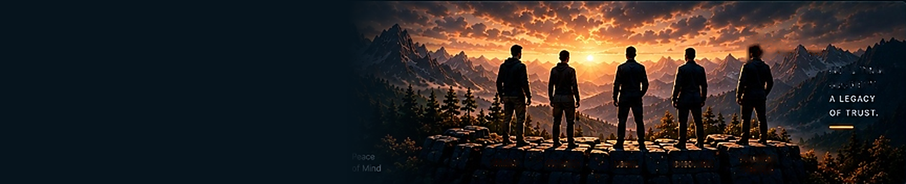

# AegisVault — Trustee Verification Module

A production-quality, responsive frontend webpage for the **AegisVault Trustee Verification Module**, built strictly with HTML5, CSS3, and Vanilla JavaScript with zero external runtime frameworks.



---

## 🛡️ Overview

The **Trustee Verification Module** is an enterprise security interface within the AegisVault digital estate protection suite. It enables cryptographic custodians to oversee multi-layer trustee authentication before granting access to Shamir Secret Sharing (SSS) key shares.

### Key Capabilities

* **Multi-Factor Verification Timeline**: 5-step interactive verification workflow (Email, OTP, Identity e-KYC, FIDO2 Hardware Key, SSS Share Ownership).
* **Cryptographic Verification Inspection**: Deep inspection modal showcasing zero-knowledge proof tokens, Pedersen commitment hashes, and on-demand re-verification simulation.
* **Dynamic Methods Configuration**: Configure and toggle authentication factors (Email, OTP, Gov ID, 2FA, Biometrics) with instant UI synchronization.
* **Automated Threat Detection**: 6 active behavioral heuristic rules (Impossible travel, unusual IP geolocation, multiple failed OTPs, automatic temporary lock).
* **Live Audit Activity Feed**: Searchable and filterable activity timeline (All, Successful, Failed) tracking verification events.
* **Global Search & Command Bar**: Real-time fuzzy search across trustees, verification steps, and security settings with `/` keyboard shortcut.
* **Dark / Light Enterprise Theming**: Seamless theme switching with persistent client-side storage.
* **Full Responsive Adaptability**: Optimized for viewports from 320px mobile screens up to 1920px 4K displays.

---

## 📁 Project Structure

```text
Trustee Verification Module/
├── index.html                  # Main application markup & modal templates
├── css/
│   ├── style.css               # Core design tokens, dark theme, layout, components
│   ├── responsive.css          # Responsive breakpoints (320px, 375px, 430px, 768px, 1024px, 1440px, 1920px)
│   └── animations.css          # Smooth keyframes, scroll reveals, pulse glows, spinners
├── js/
│   ├── app.js                  # Application initialization & navigation renderer
│   ├── verification.js         # Verification engine, timeline logic, step & method modals
│   ├── interactions.js         # Search, theme toggle, notifications, profile menu, toasts
│   └── mockData.js             # Central mock repository for trustees, steps, logs & rules
├── assets/
│   ├── background-image.png    # Mountain sunset hero artwork extracted from reference image
│   ├── sidebar-bg.png          # Sidebar promo card artwork
│   ├── avatar.png              # Trustee photo avatar for Rakesh Patel
│   └── icons/                  # SVG assets directory
└── README.md                   # Project documentation & run guide
```

---

## 🚀 How to Run Locally

This project is built using native web technologies and requires no bundlers, compilation, or package installations.

### Option 1: Live Server in VS Code / Antigravity IDE
1. Open the workspace folder in your editor.
2. Right-click `index.html` inside `Trustee Verification Module/` and select **"Open with Live Server"**.

### Option 2: Local HTTP Server (Python)
Run the following command from terminal:
```bash
cd "Trustee Verification Module"
python -m http.server 8080
```
Then navigate to `http://localhost:8080` in your web browser.

### Option 3: Direct Browser Launch
Double click `index.html` to open directly in any modern browser (Chrome, Edge, Firefox, Safari).

---

## 🎨 Design System Specifications

* **Primary Background**: `#06141D` (Deep Cyber Navy)
* **Card Surface**: `#0B2029` (Dark Slate Glass)
* **Elevated Card**: `#102A34`
* **Brand Gold Accent**: `#F5A84B` / `#D97706`
* **Verification Emerald**: `#00D9A5` (Glow: `rgba(0, 217, 165, 0.3)`)
* **Alert Danger**: `#FF5757`
* **Typography**: Plus Jakarta Sans & JetBrains Mono

---

## 🔒 Security Compliance Note

This application is a frontend verification prototype operating with simulated cryptographic telemetry. In production environments, client-side requests integrate with AegisVault Zero-Knowledge Proof (ZKP) APIs, FIDO2 WebAuthn credentials, and national e-KYC gateways.
